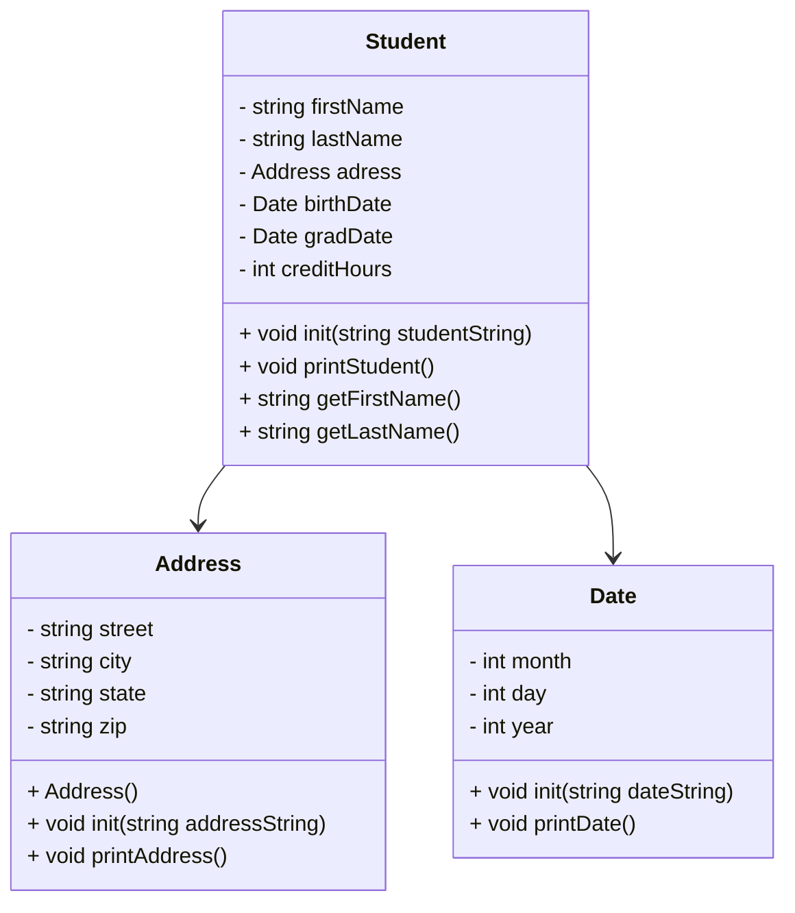

# heapStudents2

```mermaid
classDiagram

class Address {
    - string street
    - string city
    - string state
    - string zip
    + Address()
    + void init(string addressString)
    + void printAddress() 
}

class Date {
    - int month
    - int day
    - int year
    + void init(string dateString)
    + void printDate()
}

class Student{
    - string firstName
    - string lastName
    - Address adress 
    - Date birthDate
    - Date gradDate
    - int creditHours

    + void init(string studentString)
    + void printStudent()
    + string getFirstName()
    + string getLastName()
}

Student --> Address
Student --> Date
```
